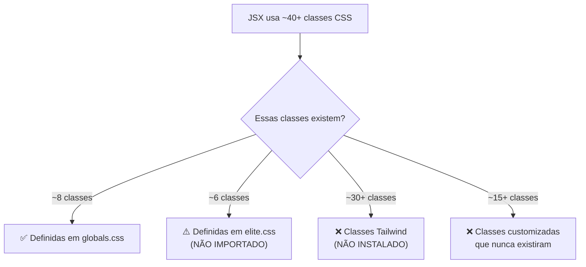

# 🔬 Diagnóstico Técnico Completo — UI Personal Agenda

## 1. Conteúdo dos Arquivos

### [layout.js](file:///f:/Projetos/Automações/Personal%20Agenda/frontend/src/app/layout.js) (Root)

```jsx
import '../styles/globals.css'

export default function RootLayout({ children }) {
    return (
        <html lang="pt-BR">
            <head>...</head>
            <body>{children}</body>
        </html>
    )
}
```

> [!IMPORTANT]
> Apenas `globals.css` é importado. O arquivo `elite.css` **NÃO é importado em nenhum lugar do projeto** — todas as regras dentro dele são código morto.

### [globals.css](file:///f:/Projetos/Automações/Personal%20Agenda/frontend/src/styles/globals.css) — 211 linhas
### [elite.css](file:///f:/Projetos/Automações/Personal%20Agenda/frontend/src/styles/elite.css) — 148 linhas (NÃO IMPORTADO)

---

## 2. Regras Globais Perigosas Identificadas

| Regra | Linha | Arquivo | Nível de Risco | Problema |
|-------|-------|---------|----------------|----------|
| `* { margin: 0; padding: 0; box-sizing: border-box }` | L23-27 | `globals.css` | ⚠️ Médio | Reset global OK, mas remove padding/margin de TUDO (inputs, selects, etc.) |
| `body { background-color: var(--bg-sidebar) !important }` | L30 | `globals.css` | 🔴 **CRÍTICO** | O body inteiro recebe a cor escura da sidebar (`#051a13`). Qualquer gap entre sidebar e conteúdo mostra este fundo verde-escuro |
| `body { overflow-x: hidden }` | L34 | `globals.css` | ⚠️ Médio | Esconde overflow horizontal — pode mascarar problemas de layout |
| `.sidebar { position: fixed !important; height: 100vh !important }` | L43-51 | `globals.css` | 🔴 **CRÍTICO** | Sidebar fixa com `100vh` + `z-index: 100`, tudo forçado com `!important` |
| `.main-content { min-height: 100vh !important; position: relative !important }` | L53-60 | `globals.css` | 🔴 **CRÍTICO** | O conteúdo principal tem `box-shadow` forçada de -10px e z-index 10 |

### Resultado visual do `body` com cor da sidebar:

```
┌──────────────────────────────────────────────┐
│ BODY = background #051a13 (verde escuro)     │
│ ┌────────┐ ┌──────────────────────────────┐  │
│ │SIDEBAR │ │ MAIN-CONTENT (bg: #f2f5f4)   │  │
│ │fixed   │ │                              │  │
│ │100vh   │ │                              │  │
│ └────────┘ └──────────────────────────────┘  │
│         ↑↑↑ GAP AQUI = mostra o body verde   │
└──────────────────────────────────────────────┘
```

Se houver qualquer mismatch entre a `width` da sidebar e o `margin-left` do conteúdo, aparece o **fundo escuro do body** como uma faixa vertical.

---

## 3. Classes do Menu Lateral (Sidebar)

### Classes usadas no JSX de [dashboard/layout.js](file:///f:/Projetos/Automações/Personal%20Agenda/frontend/src/app/dashboard/layout.js):

| Classe no JSX | Definida no CSS? | Onde? |
|---------------|-----------------|-------|
| `sidebar` | ✅ | `globals.css` L43 |
| `sidebar-open` | ❌ **NÃO** | Nenhuma regra `.sidebar-open` existe (a media query em L203 a referencia, mas ela não define `width`) |
| `sidebar-collapsed` | ❌ **NÃO** | Não existe em nenhum CSS |
| `sidebar-link-full` | ✅ | `globals.css` L104 + `elite.css` L4 (mas elite.css **NÃO é importado**) |
| `sidebar-content-wrapper` | ❌ **NÃO** | Só existe em `elite.css` L14 (não importado) |
| `sidebar-label` | ❌ **NÃO** | Não existe em nenhum CSS |
| `no-scrollbar` | ❌ **NÃO** | Não existe em nenhum CSS |
| `btn-ghost-nav` | ❌ **NÃO** | Não existe em nenhum CSS |
| `desktop-only` | ❌ **NÃO** | Não existe em nenhum CSS |
| `flex-center` | ❌ **NÃO** | Não existe em nenhum CSS |
| `bg-white/10`, `text-white/60`, etc. | ❌ **NÃO** | São classes **Tailwind CSS** — mas Tailwind **NÃO está instalado** |

> [!CAUTION]
> **Problema gravíssimo**: O JSX usa extensivamente classes utilitárias do Tailwind CSS (como `bg-white/10`, `text-white/60`, `flex`, `items-center`, `gap-3`, `p-6`, `rounded-lg`, etc.), porém **Tailwind NÃO está instalado** como dependência. Essas classes não produzem nenhum estilo.

---

## 4. Classes dos Cards

### Classes usadas na [page.js do Dashboard](file:///f:/Projetos/Automações/Personal%20Agenda/frontend/src/app/dashboard/page.js):

| Classe no JSX | Definida no CSS? | Onde? |
|---------------|-----------------|-------|
| `finebank-card` | ✅ | `globals.css` L63 |
| `card-highlight` | ❌ **NÃO** | Não existe em nenhum CSS |
| `card-premium` | ✅ (parcial) | `globals.css` L64 (mesma regra que finebank-card) |
| `card-flat` | ❌ **NÃO** | Não existe em nenhum CSS |
| `finebank-label` | ❌ **NÃO** | Não existe em nenhum CSS |
| `finebank-value` | ❌ **NÃO** | Não existe em nenhum CSS |
| `finebank-icon-wrapper` | ❌ **NÃO** | Não existe em nenhum CSS |
| `dashboard-grid` | ❌ **NÃO** | Não existe em nenhum CSS |
| `dashboard-section-header` | ❌ **NÃO** | Não existe em nenhum CSS |
| `dashboard-title` | ❌ **NÃO** | Não existe em nenhum CSS |
| `dashboard-subtitle` | ❌ **NÃO** | Não existe em nenhum CSS |
| `session-card-grid` | ❌ **NÃO** | Não existe em nenhum CSS |
| `session-time-badge` | ❌ **NÃO** | Não existe em nenhum CSS |
| `empty-state-card` | ❌ **NÃO** | Não existe em nenhum CSS |
| `empty-state-icon-wrapper` | ❌ **NÃO** | Não existe em nenhum CSS |
| `badge` | ❌ **NÃO** | Não existe em nenhum CSS |

### Outros componentes com classes fantasma:

| Classe no JSX | Definida no CSS? |
|---------------|-----------------|
| `header-title` | ❌ **NÃO** |
| `header-subtitle` | ❌ **NÃO** |
| `header-title-container` | ❌ **NÃO** |
| `dropdown-menu` | ❌ **NÃO** |
| `dropdown-item` | ❌ **NÃO** |
| `dropdown-item-danger` | ❌ **NÃO** |
| `backdrop-invisible` | ❌ **NÃO** |
| `premium-banner` | ❌ **NÃO** |
| `mobile-nav-grid` | ❌ **NÃO** |
| `mobile-nav-item` | ❌ **NÃO** |
| `mobile-nav-icon` | ❌ **NÃO** |
| `mobile-footer-section` | ❌ **NÃO** |
| `page-enter` | ❌ **NÃO** |
| `avatar-sm` | ❌ **NÃO** |
| `avatar-md` | ❌ **NÃO** |
| `bg-success` | ❌ **NÃO** |
| `text-success` (no contexto `text-success` como variável) | ❌ **NÃO** (a classe existe no CSS, mas `bg-success/10` e `text-success` usados como Tailwind não) |

---

## 5. Conflitos de Especificidade

### 🔴 Abuso massivo de `!important`

O `globals.css` usa `!important` em **44 declarações** (~65% de todas as regras). Isso torna praticamente **impossível** sobrescrever qualquer estilo inline ou via componente sem também usar `!important`.

**Exemplos concretos de conflito:**

1. **`.sidebar` no CSS vs inline styles no JSX**:
   - CSS: `height: 100vh !important` (L47)
   - JSX: `style={{ width: sidebarOpen ? '16rem' : '5rem' }}` — funciona porque `width` não está no CSS com `!important`
   - Mas a `position: fixed !important` conflita com o `flex` do container pai

2. **`.finebank-card` duplicação com `.elite-card`**:
   - `globals.css` L63: `.finebank-card, .card-premium, .elite-card` com `!important` em tudo
   - `elite.css` L23: `.elite-card` **SEM** `!important` — mas `elite.css` **nem é importado**
   - Se fosse importado, `globals.css` ganharia SEMPRE por causa do `!important`

3. **`.sidebar-link-full` definida duas vezes**:
   - `globals.css` L104: com `!important`
   - `elite.css` L4: com `!important`
   - Se ambos fossem importados → conflito de cascade (último importado venceria)

---

## 6. Diagnóstico Final — Por que a UI quebrou

### Causa Raiz: **Arquitetura CSS híbrida e incompleta**



### Os 4 problemas fundamentais:

1. **`elite.css` é código morto** — Contém definições úteis (sidebar-content-wrapper, elite-card, etc.) mas **nunca é importado** no `layout.js`. Nenhuma dessas regras se aplica.

2. **Classes Tailwind sem Tailwind** — O JSX usa extensivamente sintaxe Tailwind (`flex`, `items-center`, `gap-3`, `p-6`, `rounded-lg`, `bg-white/10`, `text-white/60`, etc.) mas o Tailwind CSS **não está instalado** no `package.json`. Essas classes simplesmente **não fazem nada**.

3. **~30 classes "fantasma" sem definição** — Classes como `dashboard-grid`, `finebank-label`, `finebank-value`, `header-title`, `dropdown-menu`, `badge`, `card-flat`, `session-card-grid`, etc. são referenciadas no JSX mas **não existem em nenhum arquivo CSS**. O layout dessas seções depende exclusivamente do browser default.

4. **`!important` em 65% das regras** — O `globals.css` abusa de `!important`, tornando impossível ajustar estilos via inline styles ou classes mais específicas. A manutenibilidade é praticamente zero.

### Impacto visual concreto:

| Componente | O que deveria ter | O que realmente tem |
|------------|-------------------|---------------------|
| Dashboard Grid | Grid responsivo de 4 colunas | Elementos empilhados (sem `display: grid`) |
| Cards (finebank-label/value) | Tipografia estilizada | Texto plain sem formatação |
| Header (header-title) | Título grande e bold | H1 default do browser |
| Dropdown menu | Menu flutuante posicionado | Div sem posição nem estilo |
| Sidebar labels | Texto formatado | Span sem estilo |
| Ícone wrapper (finebank-icon-wrapper) | Box arredondado com ícone | Div inline sem formato |
| Badge de status | Pill colorido | Span sem estilo |
| Grid de sessões | Cards lado a lado | Divs empilhadas |
| Animação page-enter | Fade-in ao navegar | Sem animação |

> [!WARNING]
> **Nenhuma alteração foi feita.** Este é um relatório de diagnóstico somente-leitura.
